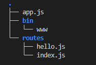

# Comparison between node core, express and fastify

## Dependencies

| core | express
|---| --- |
|http module: `require("http")`| express: `express@4` |
| | error: `http-errors@2` |

## Create server

core |
--- |
`http.createServer((req, res) => {})` |

## Start server

core |
--- |
`server.listen(PORT)` |

## Close connection

core |
--- |
`res.end(string)`|

## Set header

core |
--- |
`res.setHeader('Content-Type', 'text/html')` |

## Set status code

core |
--- |
`res.statusCode = 405` |

## Get request verb

core |
--- |
`req.method` |

## Write to the stream

core |
--- |
`res.end('abc\r\n')` |

## Default status code of response

core |
--- |
`200` |

## Project structure

core | express |
--- | --- |
as you wish | 