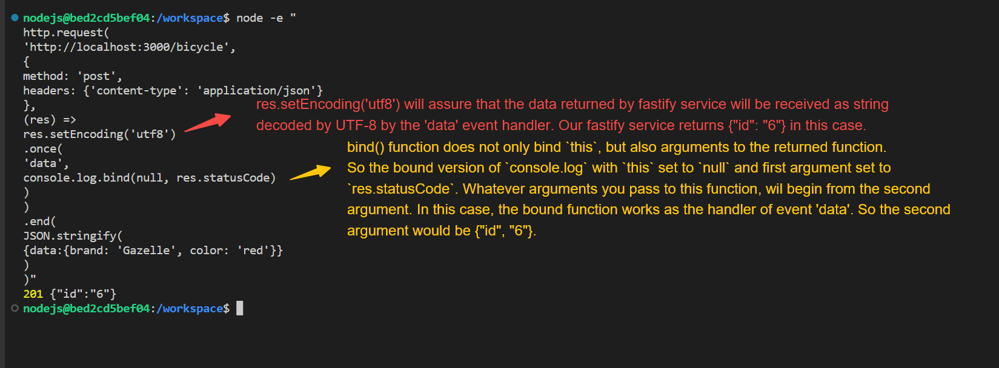

# Creating RESTFUL JSON services

## Conventions

### `PORT` environment variable

Access it via `process.env`. For `fatify-cli`, use the lower p flag `-p` to specify it.

#### Set `PORT` env

If we need to change the port to be listened by express project, we can start the project like this:

```
PORT=8080 npm start
```

### Use `start` scripts in package.json to start node.js project

```
npm start
```

```json
"scripts": {
    "start": "node ./bin/www"
}
```

### Integrate mode of `create-fastify`

```
npm init fastify -- --integrate
```

It can modify and work based on an existed `package.json` file.

## Implementing a RESTful JSON Get with Fastify

### REST

HTTP | meaning
--- | ---
body | data
header | metadata
status code | outcome

## Explanation of the code to test service


Note that `request.end()` function only accepts string, Buffer, Uint8Array. So if you want to send an object, sent JSON of that object instead.

## Keys

1. States shouldn't be stored in the process which handles HTTP request.