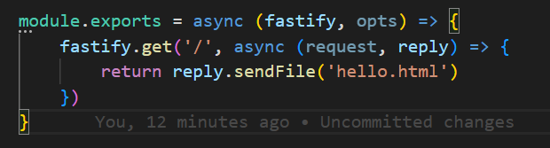
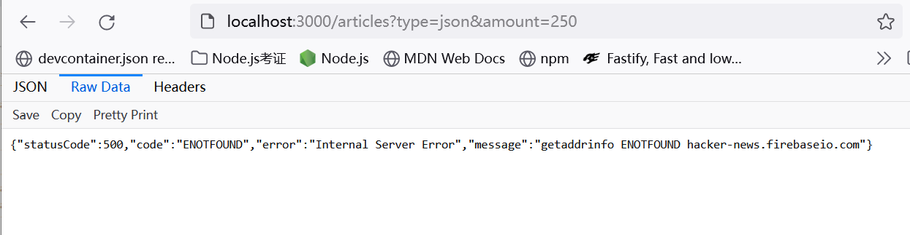

# Fastify

## Initialize fastify project

```
npm init fastify
```

```
npm install
```

## Start server

```
npm run start
```

Npm script looks like:

```
fastify start -l info app.js
```

Fastify uses fastify-cli to start a project. So we don't need a `bin/www` file like in express. We just need to export the biggest plugin in the project from `app.js`. fastify-cli will pass the server instance to it.


## Plugins

A plugin is a function which accepts server instance, `options` and `next()` as parameters. If `next()` is not in the arguments list, then it should be an async function and returns a promise.

The files in `plugins` folder are often de-encapsulated plugins which can be accessed by sibling plugins. We can regard these files as local libraries.

Every plugins (which means everything in fastify) are called at initialization time. They are always asynchronous (either with a callback or a returned promise) to allow for asynchronous initialization for every plugin.

- `fastify-autoload`

  options:

  - `dir`
    Point `fastify-autoload` plugin to where to load plugins.

  - `options`
    The options which will be passed to all the autoloaded plugins.

- `fastify-static` (deprecated)

  It can help to serve static content from fastify but it should be kept as a dev dependencies because static content should stay on some specialized services like `nginx`.

  ### Install
  `npm install --save-dev fastify-static`

  ### Usage

  Require it only in `dev` env:

  ```javascript
  const fastify = dev && require('fastify-static')
  ```

  ### Options

  - `root`

    Specify the path where to find the static content.

    ```javascript
    {
      root: path.join(__dirname, 'public')
    }
    ```
    中文速记：`Autoload` 插件 和 `fastify-static` 的两个指定路径的属性名，正好组成德鲁大叔（`dir` and `root`）。

  - `prefix`
    By default, `@fastify/static` will try to find file which exactly matches the path with the part of URL behind the first single `/`. Like `/abc/hello.html` in `http://example.org/abc/hello.html`. But if `prefix: /abc/` option is specified, the path to the file will be the part after the specified prefix. So that will be `/hello.html` in `http://example.org/abc/hello.html`.


  ### Decorations

  - `reply.sendFile(filename)`
    Don't forget to treat this sentence as a return value. This means that always coding like this:

    ```javascript
    return reply.sendFile('index.html')
    ```
   
- `@fastify/static`
  The successor of `fastify-static`. Their APIs and usages seem very similar to me right now.

- `@fastify/sensible`
  Provide helper functions for HTTP status codes and error messages.

  ### Options
  - `errorHandler`
    It is better to set it as `true` for the public facing services in production mode.
    It will provide less detailed info to the public.

  ### Decorations

  - `reply.notFound()`
    It sets 404 status code and generate **JSON** output to describe this error.

  - `fastify.httpErrors.notFound()`
    Same as `reply.notFound()`.

- `point-of-view`

  It helps at dynamic view rendering.

  - Options:

    - `engine`
      An **object** to specify render engine. eg. `{handlebars}`.
      Key is the engine name, value is the engine lib.

    - `root`
      Where to find views.

    - `layout`
      Sometimes there should be a layout. eg. `layout.hbs`.

  - Decorations:

    - `reply.view(templateFileName[, optional_template_locals])`
      `optional_template_locals` is an object whose properties will be available in the handlebars views.

## Routes

Everything in fastify is a plugin. We distinguish **plugin** and **route** in order to reason about the functionality of the project.

Any error throw inside a route handler which is not recognized by fastify will cause a 505 error as the response to the request.

## `fastify` instance

### Methods

- `fasitfy.register(plugin, options)`

- `fastify.get(path, handler)`

  - `handler` => `(request, reply) => {}`
    The handler of the route.
    It is not a plugin.
    It could be both synchronous or asynchronous.
    Its returned value will be automatically processed similar to Express and sent as the content of HTTP response.

    If this handler returns an object, fastify will convert it into a JSON payload.

    Unless the handler returns a `undefined`, otherwise fastify will consider anything returned by the handler as the response to the request. This means only synchronous handler can fit return a `undefined`. Becuase any thing an async function returns is a promise which is not `undefined`. So for async handler, make sure the expected response is returned by the handler or pass it to `reply.send()` before handler returns.

    The solution for combination of async route handler and callback-based API is to await replay at the end of the handler:

    ```javascript
    await reply
    ```

    - `request`

      #### Properties

      - `request.query`
      An object contains all query key-value pairs from URL.

    - `reply`

      #### Methods

      - `reply.send()`
        Instead of return something within the route handler, you can use this method to send response. For example: `reply.send({root: true})`.

        If an instance of `Error` is passed to this function, fastify will generate a *500* response with the error message.

- `fastify.setNotFoundHandler((request, reply)=>{})`

- `fastify.httpErros.notFound()`
  Same as the `reply.notFound()` decorated by `@fastify/sensible` to create a 404 error.
## Files

- app.js

  Entry point of the whole fastify project. It exports an async function which is also a plugin. `fastify-autoload` plugin is registered twice here.

  - routes

    - root.js
      This file exports an async function which accepts `fastify` instance and an options object as argument. So it also exports a plugin function.

      It calls `fastify.get()` to register an HTTP GET route.

    - example

      - index.js

## `fastify-cli`

### Flags

  - `-p`
    Specify the server port. Defaults to 3000.

  - `-w`
    Watch the project files and auto reload.

  - `-P`
    Prettify the log output.

## Notes

1. Even in the handler of `fastify.setNotFoundHandler()`, one still needs to set the status code of the reply object via `reply.status(404)` or `reply.status(405)` and so on.

2. Why should one add `return` before calling `fastify.sendFile()`?

   

   We take this as an example. So if we omit the return keyword, the function will invoke an implicit `return undefined` at last. We can imagine that `reply.sendFile()` function will use some asynchronous method because it will do some I/O work to read and load some file. So the implict `return undefined` will called first, then `reply.sendFile()`.

   On the other hand, once route handler returns something, fastify will treat anything returned as the response for the request. In our case, the returned value is `undefined` which will cause fastify reply the request with no content but header only.

   After that, `reply.sendFile()` will finish reading file and try to write the content of the file into the stream. But guess what, the stream is already closed due to `return undefined`. That's why we will see some error which complains that `"Reply was already sent."`.

3. Remember `'use strict'`.

4. Due to fastify takes care of streams including error-handling, if some error occurs, fastify will handle the error and pass the error to the user directly.
   For example:
   

5. Use this to ensure aysnc route handler returns too early:

   ```javascript
   await reply
   ```

6. Fastify will also throw 404 when facing non-registered `method` instead of 405 by default.

7. How to deal with the error reported from with a promisified function?

   Use `try catch` block to surround the promisified function to catch the error and deal with responding logic inside the `catch{}` block. A common way is to re-throw an error inside the async handler and let fastify to deal with the rest of the work automatically.